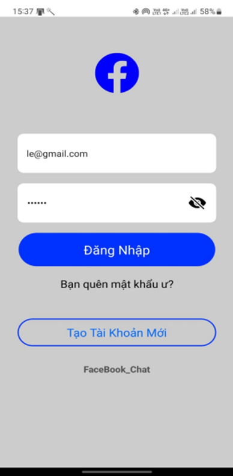
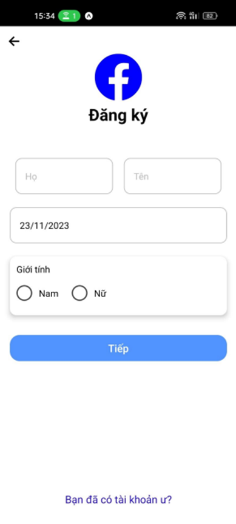
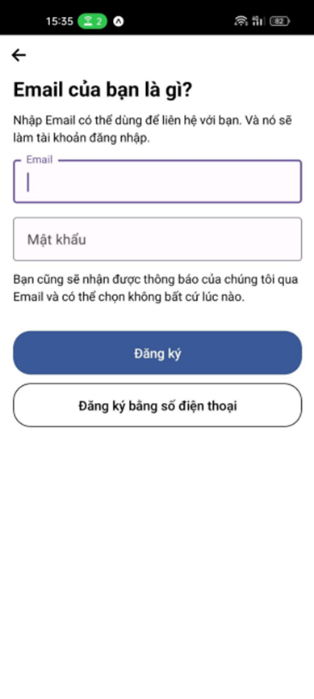
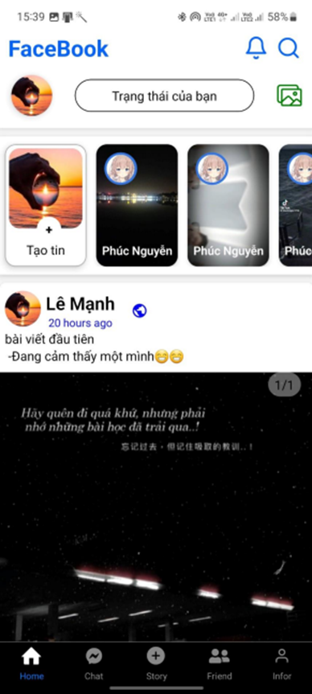
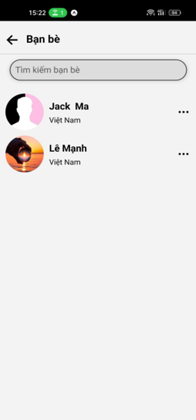
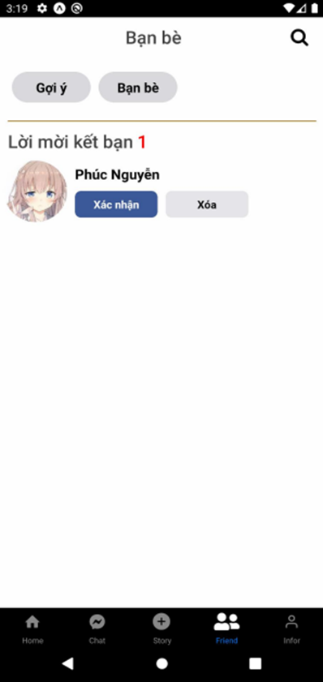
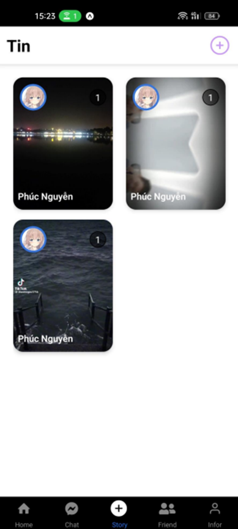
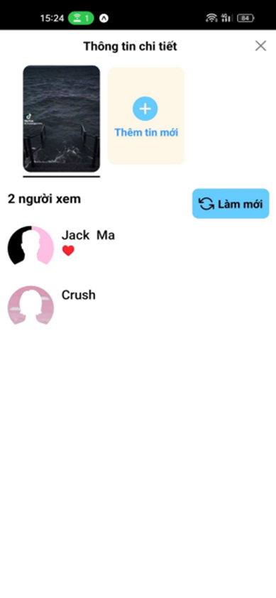
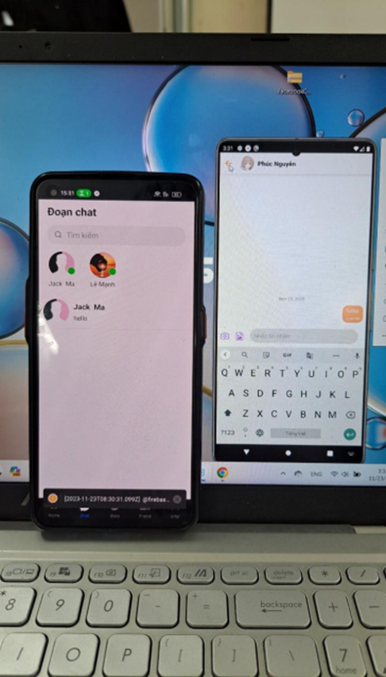

# Facebook Chat
*Phần mềm mạng xã hội*

> Cross Platform: React-native

## Mô tả:
>Phần mềm sử dụng Firebase của google và các thư viện khác bên ngoài
>Các chức năng được tái hiện lại tương tự app Facebook

## Demo giao diện đã và chức năng đã xây dựng

#### 1. Authentication

>Tài khoản phải đúng định dạng Email và đã được xác minh tài khoản sau khi đã đăng ký
> Mật khẩu phải tối thiểu 6 kí tự

---

---

> Nếu người dùng nhập Email đã tồn tại trên hệ thống thì hiển thị thông báo email đã tồn tại
> 

---

#### 2. App
> Trang chủ sẽ hiển thị tất cả các bài viết, story của mình và bạn bè, tương tác, comment, đăng bài viết mới....

---

>Hiển thị tất cả bạn bè đã kết bạn , có thể tìm kiếm bạn bè

---

>Hiển thị danh sách lời mời kết bạn

---

---

---

---

---

## Xây dựng ứng dụng:
1. Nguyễn Văn Phúc
2. Lê Văn Mạnh

### Thực hiện các chức năng:
Nguyễn Văn Phúc: *Đăng ký, Chat, Quản lý bạn bè, Kết bạn, đăng story, xem story*